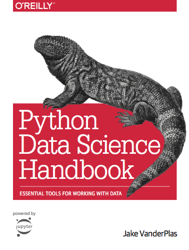
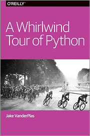

# 3603-Programming-for-Data-Science

## 🧱 Phase 1: Foundation Planning

### 🎯 Course Goals

<!-- - **Audience**: Non-CS majors, low programming experience
- **Approach**: Project-based with a final exam and study guide
- **Tools**: Jupyter Notebooks (lecture + assignments)
- **Content split**: ~30–40% textbook, ~60–70% your custom materials -->

### Books Source

|                                  |                                   |
| :------------------------------: | :-------------------------------: |
|  |  |

Using Jake VanderPlas’ Jupyter notebooks, I've developed a **14-week data science course** that is:

- beginner-friendly,
- steadily paced,
- and project-focused.

It integrates hands-on coding with conceptual understanding and light math intuition, ideal for young programmers or non-CS majors.

---

### 🗓️ **14-Week Data Science Course (VanderPlas-based)**

| **Week** | **Theme**                                       | **Topics**                                                                                                                                                        |
| -------- | ----------------------------------------------- | ----------------------------------------------------------------------------------------------------------------------------------------------------------------- |
| **1**    | **Getting Started with Data Science**           | - What is data science? - Setting up Jupyter & IPython basics - Python review: variables, data types, loops - Help, magic commands, input/output history |
| **2**    | **Working with Arrays (NumPy)**                 | - NumPy arrays: creation & indexing - Universal functions (ufuncs) - Aggregation and broadcasting - Fancy indexing, masks, filtering                     |
| **3**    | **Manipulating DataFrames (Pandas 1)**          | - Series & DataFrames - Indexing & selection - Operations & filtering - Handling missing data                                                            |
| **4**    | **DataFrames Continued (Pandas 2)**             | - Combining datasets (merge, join, concat) - GroupBy and aggregation - Time series basics - String operations                                            |
| **5**    | **Exploratory Data Analysis**                   | - Project: “Your First Dataset” - Read CSV, clean, summarize - Ask questions, answer with Pandas - Light intro to `.query()` / `.eval()`                 |
| **6**    | **Plotting with Matplotlib**                    | - Line, scatter, bar, hist - Subplots, colors, annotations - Styles and config - Errors, ticks, and legends                                              |
| **7**    | **Better Visuals with Seaborn**                 | - Categorical plots - Pairplots, heatmaps - Styling and palettes - Multivariate plotting                                                                 |
| **8**    | **Project: Visual Storytelling**                | - Project: Tell a story with data - Pick a topic (sports, music, etc.) - Visual narrative using Matplotlib/Seaborn - Present findings                    |
| **9**    | **Modeling: Regression**                        | - What is modeling? - Correlation vs. causation - Linear regression (scikit-learn) - Train/test split, metrics                                           |
| **10**   | **Classification: Naive Bayes, Decision Trees** | - Supervised learning basics - Naive Bayes intuition - Decision Trees + feature importance - Accuracy, confusion matrix                                  |
| **11**   | **Beyond Basics: SVMs and k-NN**                | - SVM intuition - k-Nearest Neighbors - Hyperparameters & validation - Project: Classify your dataset                                                    |
| **12**   | **Unsupervised Learning**                       | - K-means clustering - Principal Component Analysis (PCA) - DBSCAN or Gaussian Mixture Models                                                               |
| **13**   | **Putting It Together**                         | - Face detection walkthrough OR mini project - Model pipelines - Final project planning - Optional: Kernel Density Estimation                            |
| **14**   | **Final Project + Review**                      | - Final project presentations - Study guide & course wrap-up - Concept review & practice exam                                                               |

---

### 🧠 Course Notes

- **3 Mini-Projects**:

  - Week 5: First data analysis
  - Week 8: Visual narrative
  - Week 11: Classifier on student-chosen dataset

- **Final Project Ideas**:

  - Sports predictions
  - Spotify data trends
  - COVID or flu pattern analysis
  - Campus-related mini-research (cafeteria hours vs. attendance?)

- **Light Math Approach**: Focus on **intuition over derivation**, especially in modeling weeks.

- **Optional Deeper Topics**:
  - Kernel density estimation (Week 13)
  - 3D plotting and mapping (as bonus content)
